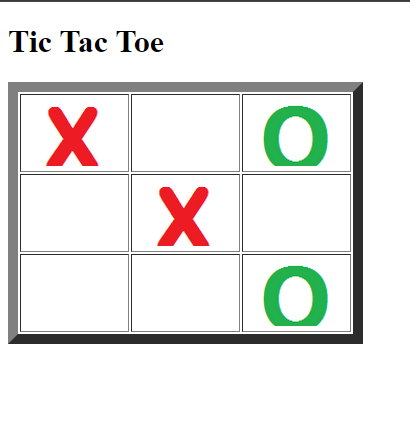

# TicTacToe

Proyecto **Tres en Raya (Tic Tac Toe)** desarrollado en Java (JSP/Servlets).

## 📌 Descripción
Este proyecto implementa el clásico juego de **Tic Tac Toe (Tres en Raya)** donde el usuario juega contra la computadora.  
Se desarrolló como práctica de programación web usando **Java**, **JSP** y **Servlets**.

## 🚀 Características
- Usuario vs Computador.
- Detección de victoria, empate y turnos.
- Mensajes completamente en **español**.
- Reinicio del juego con un solo clic.

## 🖼 Ejemplo de interfaz

> ⚠️ Asegúrate de guardar una captura de tu juego en la carpeta `docs` con el nombre **`captura.png`** para que esta imagen se muestre correctamente en GitHub.

## 🛠 Requisitos
- Java 17+ (o la versión que uses).
- Servidor de aplicaciones (Tomcat o WildFly).
- Maven o Eclipse (Dynamic Web Project).

## ▶️ Ejecución
1. Compila el proyecto.
2. Despliega la aplicación en tu servidor de aplicaciones.
3. Abre en el navegador la URL correspondiente (ejemplo: `http://localhost:8080/TicTacToe`).

## 👤 Autores
- **karolocoro**
- 📧 karolocoro@unicauca.edu.co
- **juanzemanate**  
- 📧 juanjzemanate@unicauca.edu.co
